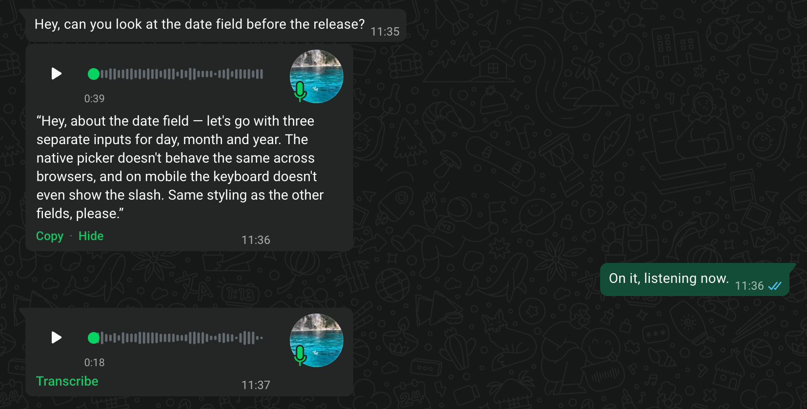

# WA Voice Transcribe

A Chrome MV3 extension that adds a **Transcribe** link to every voice message on
WhatsApp Web. The transcript appears inside the same bubble, styled to match
WhatsApp's own transcript UI.

No build step, no npm dependencies. Load the folder as an unpacked extension and
it runs.



*Real WhatsApp Web. A test conversation, so no private messages — the voice notes
were recorded for this screenshot, and the text above is what the extension
actually produced from them.*

> **Not affiliated with, endorsed by, or sponsored by WhatsApp or Meta.**
> This is an independent, unofficial project. "WhatsApp" is a trademark of its
> respective owner and is used here only to describe what the extension works
> with.

## How it works

WhatsApp media is end-to-end encrypted. The only place the audio exists in the
clear is in the page's memory, inside the `Blob` that WhatsApp passes to
`URL.createObjectURL` to feed the `<audio>` element.

`inject.js` runs in the **MAIN world** and installs two complementary hooks.

**1. `URL.createObjectURL`** — keeps every `audio/*` `Blob` in a `Map` (50
entries, FIFO). `revokeObjectURL` is patched to **not** drop the entry: WhatsApp
revokes the URL almost immediately, and after that the blob can no longer be
fetched.

**2. `HTMLMediaElement.prototype`** (the `src` setter and the `play` method) —
tells us *which* blob URL starts playing and *when*.

The second hook is not optional. **WhatsApp never inserts the audio element into
the DOM.** It uses a detached `new Audio()`, which no `querySelector` can reach —
`document.querySelectorAll('audio').length` stays `0` even during playback.
Looking for an `<audio>` inside the bubble is a dead end; hooking the prototype
is the only way to see it.

So the flow looks for no element at all: it starts playback and asks `inject.js`
for the first audio blob that started playing **after that instant**. The causal
link with the click is what guarantees it is that message's audio, with no risk of
grabbing the wrong voice note.

The forced playback is *armed*: `inject.js` mutes it, stops it on the first tick
and rewinds it, so nothing is audible and the voice note is not marked as played.

Consequences:

- no file is ever written to disk;
- no request is ever made to WhatsApp's servers;
- the only network request is the one to the transcription provider you chose.

## Install

1. Open `chrome://extensions`
2. Turn on **Developer mode**
3. **Load unpacked** → select this folder
4. Open the extension's options, pick a provider and paste your API key
5. Reload `https://web.whatsapp.com`

Requires Chrome 111 or later (`"world": "MAIN"` in content scripts).

## Providers

The extension talks to any service that speaks the **OpenAI audio transcription
API**. That is not a coincidence: Groq's endpoint is OpenAI-compatible, so one
engine covers several services and a self-hosted server alike.

| provider | endpoint | key |
|---|---|---|
| **Groq** (default) | `https://api.groq.com/openai/v1` | [console.groq.com/keys](https://console.groq.com/keys) |
| **OpenAI** | `https://api.openai.com/v1` | [platform.openai.com/api-keys](https://platform.openai.com/api-keys) |
| **OpenRouter** | `https://openrouter.ai/api/v1` | [openrouter.ai/keys](https://openrouter.ai/keys) |
| **Custom** | whatever you enter | whatever your server expects |

OpenRouter is an aggregator: one key reaches many models, including Groq's fast
Whisper. Its model field is free text rather than a dropdown, because the
catalogue is large and moves — paste any slug from
[openrouter.ai/models](https://openrouter.ai/models). The default is
`openai/whisper-large-v3` rather than `openai/whisper-1`, because WhatsApp voice
notes are **ogg/opus** and `whisper-1` does not list ogg among its accepted
formats.

> Whether every OpenRouter-routed model accepts ogg has not been verified against
> the live API. If a model rejects the upload, try `openai/whisper-large-v3`.

### Using *Custom*

*Custom* covers everything else, including a model on your own machine — in which
case no audio leaves it at all. Enter the base URL, and the extension appends
`/audio/transcriptions`.

| service | base URL |
|---|---|
| DeepInfra | `https://api.deepinfra.com/v1` |
| whisper.cpp `server` | `http://localhost:8080/v1` |
| speaches / faster-whisper-server | `http://localhost:8000/v1` |
| LocalAI | `http://localhost:8080/v1` |
| LM Studio | `http://localhost:1234/v1` |
| vLLM | `http://localhost:8000/v1` |

Ports are the usual defaults; use whatever yours is configured for. These are
starting points, not a compatibility promise: each service decides which models
and audio formats it accepts.

**Each provider keeps its own key.** Switching in the options does not overwrite
the one you had, so you can move between them freely.

Keys are never hardcoded and never leave your computer except as the
`Authorization` header of the request to the provider you picked.

### Host permissions

Only Groq's domain is requested at install time. Everything else is an **optional
permission**, asked for when you actually select it: the options page shows a
*Grant access* button and Chrome prompts for that one origin. Pick a provider you
never use and the extension has no way to reach it.

Plain `http` is refused except on `localhost` and `127.0.0.1` — anywhere else the
API key would travel unencrypted.

## Options

| setting | default |
|---|---|
| Provider | Groq |
| API key | — (kept per provider) |
| Endpoint base URL | — (custom provider only) |
| Voice note language | empty (automatic detection) |
| Model | the provider's default |
| Keep transcripts | forever |

## Interface

Inside the bubble, a row of up to three links appears:

| link | when | what it does |
|---|---|---|
| **Transcribe** | always | starts the transcription ("Show transcript" when collapsed) |
| **Copy** | once a transcript exists | copies the text to the clipboard |
| **Hide** | once a transcript exists | collapses the panel without touching the cache |

**Hide** deletes nothing: the text stays in memory and **Show transcript** reopens
it instantly, with no network call.

Colours are not fixed values: they come from the design tokens WhatsApp Web
exposes on `:root`, so the UI follows the light and dark themes on its own.

| token | used for |
|---|---|
| `--WDS-accent` | the green links |
| `--message-primary` | the transcript text |
| `--WDS-systems-bubble-content-deemphasized` | dimmed text |
| `--WDS-secondary-negative` | errors |

When the transcript appears — whether the transcription just finished or you
pressed **Show transcript** — it is brought into view with
`scrollIntoView({ block: 'nearest' })`, which scrolls the minimum necessary and
does nothing if it is already visible. Scrolling is tied **only** to user
actions: the automatic re-render from the cache, which fires when an already
transcribed row scrolls back into view, never moves the conversation.

### Anchoring

The block is attached by climbing from the playback control to the ancestor that
holds both the waveform (`<canvas>`) and the avatar (``), then inserting into
that element's parent. This is a *structural* criterion, which is why it is the
primary one: it works even on a row that has not been laid out yet.

Both conditions matter. Stopping at the `<canvas>` is not enough: the avatar sits
in an outer container, beside a column holding the player and the duration, so the
transcript would end up *inside* that column — narrow text with the avatar
vertically centred next to it. Climbing until the avatar is included lets the text
take the full width and flow underneath it, the way the native UI does.

### Width

WhatsApp's bubble is sized by its content (shrink-to-fit), so a long text would
stretch it to its `max-width`, far beyond the player's width. The block uses
`width: 0` — contributing `0` to the container's intrinsic width — plus
`min-width: 100%`, which then makes it fill whatever width the bubble settled on
by itself. The transcript wraps inside the bubble without ever widening it.

Vertical spacing is `padding`, not `margin`: being the container's last child, a
vertical margin would collapse with the container's own and end up outside the
bubble instead of creating space.

## Cache and expiry

Every transcript is stored in `chrome.storage.local` under `t:<data-id>`, where
`data-id` is WhatsApp's own message identifier and is therefore stable. Clicking
the same voice note again serves the text from the cache with no network call, and
the transcript is re-rendered automatically when the row reappears after a scroll
or a page reload.

Retention is configurable: forever (default), 7, 30, 90 days or 1 year. The
cleanup works on two fronts, because neither is enough alone:

- **on read**, in the content script: an expired entry is not shown and is removed
  immediately;
- **on a periodic sweep**, in the service worker (`chrome.alarms`, at browser
  start and every 12 hours): needed because a transcript in a chat that is never
  reopened would never be read, and would sit in storage forever.

Entries written before expiry existed are bare strings with no timestamp: they get
stamped rather than thrown away. Corrupted entries are removed.

A voice note whose transcript has expired simply shows **Transcribe** again.

## Maintenance

WhatsApp Web's CSS classes are hashes that change often, so nothing here depends
on them. Detection is structural — a voice note is a row containing a `<canvas>`
waveform *and* a playback control — which also means it works in every interface
language.

The `aria-label` regex in `SELECTORS` (top of `content.js`) is only a **last
resort** for unexpected structures. It covers six languages, and WhatsApp ships
about sixty: relying on it was the reason the link failed to appear at all for
most users.

If something breaks, `SELECTORS` is where to start.

## Privacy

Voice note audio is sent to the provider you configured, and transcripts are
stored in plain text in `chrome.storage.local`. With a self-hosted custom endpoint
the audio never leaves your machine. See [PRIVACY.md](PRIVACY.md).

## Disclaimer

This project is not affiliated with, endorsed by, or sponsored by WhatsApp LLC or
Meta Platforms, Inc. It is an independent browser extension that runs in your own
browser, on your own session. All product names and trademarks belong to their
respective owners and are used for identification only.

The extension does not automate WhatsApp beyond the play/pause needed to decrypt
the audio you explicitly asked to transcribe. Using it is your responsibility, and
you should check it against WhatsApp's own terms of service before relying on it.

## Structure

```
manifest.json
inject.js      # MAIN world — createObjectURL + media prototype hooks, postMessage bridge
content.js     # ISOLATED world — observer, UI, orchestration
background.js  # service worker — engines, cache sweep
providers.js   # provider table and URL helpers  (shared module)
settings.js    # storage shape and migration     (shared module)
options.html
options.js
styles.css
icons/
_locales/      # en (default), it
docs/          # README assets and store listing copy
scripts/       # store packaging
```

## Adding a provider

If the service speaks the OpenAI audio transcription API, it is a row in
`providers.js` — no new code:

```js
export const PROVIDERS = {
  // …
  mine: {
    label: 'My service',
    baseUrl: 'https://api.example.com/v1',
    origin: 'https://api.example.com/*',
    keysUrl: 'https://example.com/keys',
    models: ['some-model'],
    defaultModel: 'some-model',
    maxBytes: 25 * 1024 * 1024
  }
};
```

Add the origin to `optional_host_permissions` in the manifest and register the id
in `ENGINES`, pointing at `OpenAICompatibleEngine`. The options page picks the new
entry up on its own.

## Adding an engine

A service with its own request and response shape — Deepgram or AssemblyAI, say —
needs an engine instead. Implement `TranscriptionEngine` in `background.js` and
register the class in `ENGINES`; the content script needs no changes.

```js
class DeepgramEngine extends TranscriptionEngine {
  async transcribe({ base64, mime, language }) { /* -> string */ }
}
const ENGINES = { groq: OpenAICompatibleEngine, deepgram: DeepgramEngine };
```

## Translating

Message catalogs live in `_locales/<lang>/messages.json`. `en` is the default
locale, and the UI ships in **English, Italian, Spanish, French, German and
Portuguese** — Chrome picks whichever matches the browser and falls back to
English.

Adding a language means copying `_locales/en` and translating the `message`
values. Leave alone:

- `extName` — the product name
- the `$TOKEN$` placeholders, which carry numbers and error text into the string
- technical strings such as `chrome.storage.local`, `/audio/transcriptions`,
  `ISO-639-1` and the model names

`scripts/preflight.py` enforces all of that before a package is built: it fails
if a locale is missing a key, drops a placeholder, or has a description over the
store's 132 character limit.
